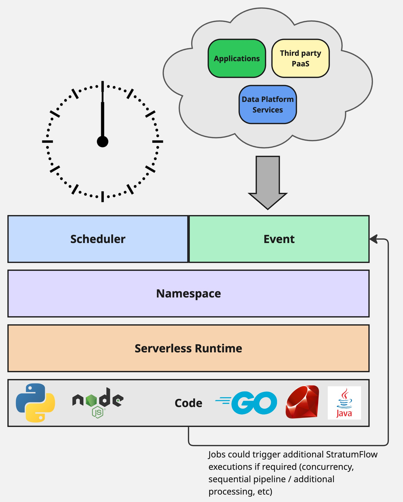

# StratumFlow

A practical and layered approach to handling cloud native job execution on Google Cloud.

Designed to work with:
- Google PubSub
- Google Cloud Scheduler
- Google Cloud Run Functions

## Infrastructure setup

TBD

## PubSub Topic to Cloud Function mapping

Many Cloud Functions will map and subscribe to PubSub Topics that receive a message directive from Google Cloud Scheduler. The Cloud Scheduler push to PubSub topic is the initial trigger that creates the message in the topic that the Cloud Function subscribes to.

Ensure the PubSub Topic & Cloud Scheduler job exist.

## Example Paubox use case for Cloud Functions

## Local Setup

1. Make sure you have [uv](https://docs.astral.sh/uv/)
2. Clone the repo
3. Create virtual environment with `uv venv `.
4. Activate the virtual environment with `source .venv/bin/activate`
5. Install the project's pinned Python version with `uv python install`
6. Install all deps with `uv sync --all-extras --dev`
7. Run tests locally with `uv run pytest ./tests`

## CI/CD

There is a tests workflow.

There is a deployment workflow.
